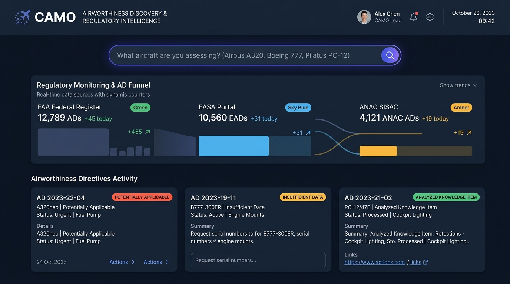
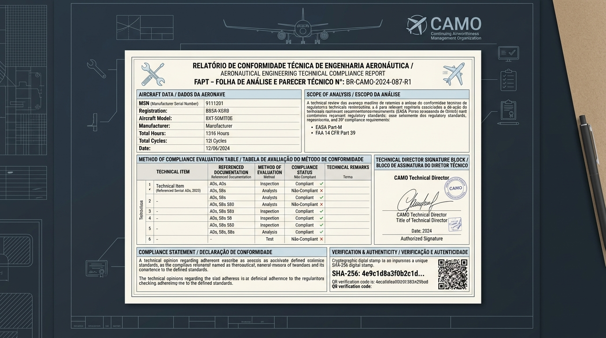
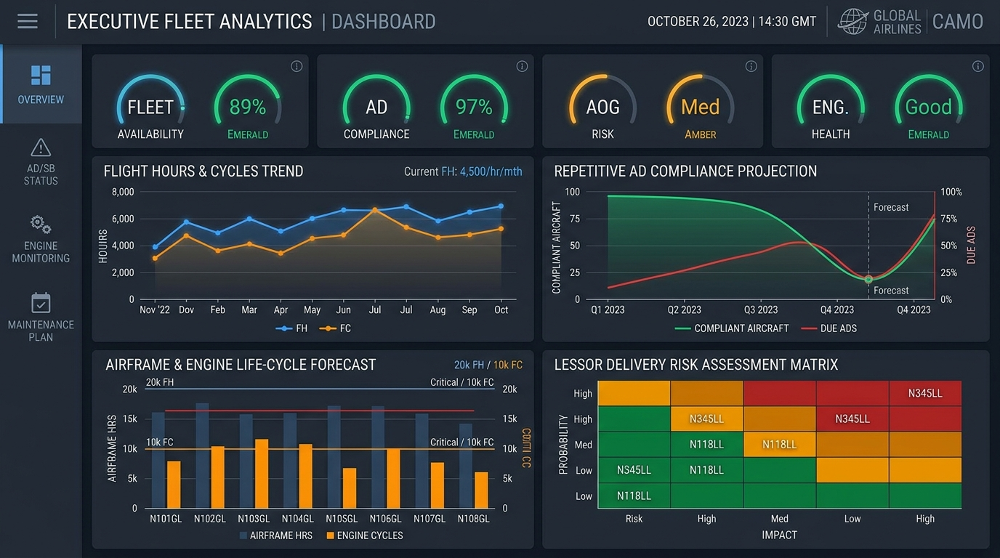
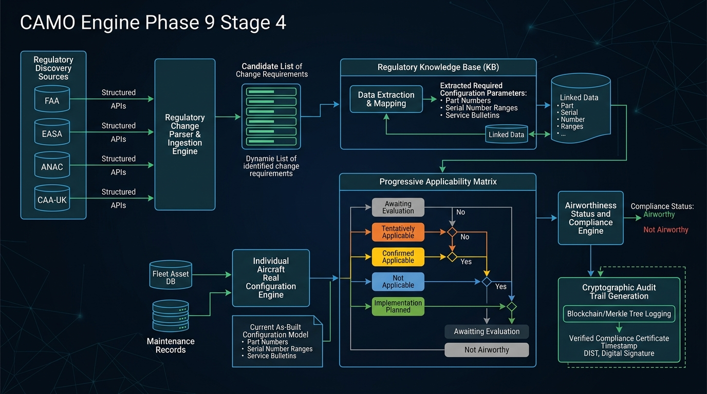

<div align="center">

# ✈️ CAMO Airworthiness Compliance Intelligence Platform
### Enterprise Aviation Continuing Airworthiness & Regulatory Intelligence Engine
**Conforme FAA 14 CFR Part 39 • EASA Part-M (CAMO) • ANAC RBAC 121 & RBAC 39**

[](https://www.easa.europa.eu/)
[](./DOSSIE_ARQUITETURA_SISTEMA_CAMO.md)
[](https://ai.google.dev/)
[-success.svg?style=for-the-badge)](./test/)

---

<p align="center">
  <b>A solução definitiva para Linhas Aéreas, Empresas de Leasing Aeronáutico (Lessors) e MROs eliminarem riscos de AOG (Aircraft On Ground), multas regulatórias e perdas milionárias em devolução de aeronaves.</b>
</p>


*Cockpit Executivo & Monitoramento Contínuo de Aeronavegabilidade em Tempo Real: Telemetria de Frota, Alertas de Diretrizes Críticas e Indicadores de Conformidade.*

</div>

---

## 💼 Visão Executiva & Proposta de Valor

No setor de aviação comercial, uma aeronave inoperante por não-conformidade documental (**AOG**) acarreta prejuízos entre **US$ 50.000 e US$ 150.000 por dia**, além de severas sanções regulatórias e riscos de segurança de voo. Na devolução de aeronaves para Lessors (*redelivery*), discrepâncias nos registros técnicos podem resultar em glosas contratuais que superam **US$ 2 milhões por célula**.

O **CAMO Airworthiness Compliance Intelligence Platform** foi concebido por engenheiros aeronáuticos e arquitetos de software para transformar o controle de aeronavegabilidade de um processo reativo e manual em um ecossistema inteligente, preventivo e auditável.

### 🌟 Pilares Estratégicos

| Pilar Estratégico | Como Funciona | Impacto no Negócio |
| :--- | :--- | :--- |
| **🛡️ Risco Regulatório Zero & Prevenção de AOG** | Rastreabilidade matemática de thresholds por Horas de Voo (FH), Ciclos (FC) e Calendário Civil exato. | Eliminação de paralisações não planejadas e garantia de voabilidade contínua. |
| **🧠 Document Intelligence (Gemini 3.7 Flash)** | Ingestão e extração instantânea de PDFs regulatórios complexos emitidos por FAA, EASA e ANAC. | Redução de até 85% no tempo de triagem técnica de ADs e Boletins de Serviço (SBs). |
| **⚖️ Princípio Zero da Segurança Aeronáutica** | A IA extrai e estrutura os dados; o motor determinístico avalia a frota; o Engenheiro CAMO valida e homologa. | Impossibilidade de alucinação ou declaração indevida de conformidade por algoritmos. |
| **💼 Reconciliação Ágil de Leasing & Redelivery** | Sandbox seguro para auditar aeronaves candidatas sem contaminar os registros da frota em operação ativa. | Transição de frota até 3x mais rápida e auditorias de pré-compra transparentes. |
| **🔒 Trilha de Auditoria Criptográfica SHA-256** | Cada avaliação, alteração cadastral e assinatura gera um bloco com hash criptográfico inviolável. | Prontidão permanente para auditorias de autoridades aeronáuticas e conselhos fiscais. |

---

## 🖥️ Telas do Sistema & Módulos Estratégicos

### 1. Descoberta Regulatória Aberta & Diagnóstico Multi-Fonte (Fase 9 — Etapa 4.1)
O CAMO Engine **rompe a barreira de listas fechadas de frotas**. Através da experiência *"What aircraft are you assessing?"*, engenheiros podem consultar qualquer fabricante, família, modelo ou variante (Airbus A320/A330/A350, Boeing 737/777/787, Embraer E-Jets/E2, ATR 42/72, Pilatus PC-12, Cessna Citation, Gulfstream, etc.) com conexão direta à **API pública do Federal Register (FAA 14 CFR Part 39)**, **EASA Safety Publications Tool** e **ANAC SISAC**.

<div align="center">
  
  <p><i>Motor de Descoberta Aberta com Pipeline de Auditoria em Tempo Real, Contadores Multi-Fonte (FAA/EASA/ANAC) e Paginação Dinâmica.</i></p>
</div>

* **Funcionalidades Estratégicas de Descoberta:**
  - **Pesquisa Aberta Universal:** Normalização aeronáutica avançada capaz de identificar fabricante, família e escopo de modelos a partir de texto livre.
  - **Pipeline de Auditoria Transparente:** Painel diagnóstico rastreando o ciclo completo (*Raw retrieved → Normalized → Candidates before filter → After filter → Duplicates removed → Final candidates*).
  - **Relatório Diagnóstico Exportável:** Auditoria em texto plano (*Section 6 Plain-Text Diagnostic*) pronta para auditorias de conformidade com cópia em um clique.
  - **Paginação e Filtros de Alta Precisão:** Controle de escopo de páginas da API do Federal Register com busca combinada por autoridade emissora e palavras-chave técnicas (ex.: *CFM56, actuator, ELAC, RAT, P/N*).

---

### 2. Matriz de Aplicabilidade Progressiva & Base de Conhecimento
Antes de confrontar dados físicos da aeronave, as diretrizes analisadas são compiladas em uma Base de Conhecimento Reutilizável por Família/Modelo, eliminando riscos de contaminação de frota.

<div align="center">
  
  <p><i>Matriz de 5 Estados de Aplicabilidade Progressiva, Extração Inteligente de Requisitos e Checklist Dinâmico de Lacunas Operacionais.</i></p>
</div>

* **Matriz de 5 Estados Regulatórios:**
  - `POTENTIALLY_APPLICABLE`: Compatibilidade preliminar por modelo/família.
  - `INSUFFICIENT_DATA`: Pendência de parâmetros cadastrais específicos. **Regra de ouro: ausência de dado nunca é tratada como não aplicável.**
  - `REVIEW_REQUIRED`: Divergência entre documentação técnica e dados físicos.
  - `APPLICABLE`: Todos os parâmetros confirmam a aplicabilidade mandatória.
  - `NOT_APPLICABLE`: Atestado probatório irrefutável de isenção ou modificação terminatória já incorporada.
* **Resolutor de Lacunas In-Loco:** Interface ágil para o engenheiro sanar lacunas cadastrais com recálculo instantâneo da completude da aeronave.

---

### 3. Emissão de Folha de Análise e Parecer Técnico (FAPT)
O CAMO Engine automatiza a geração das **FAPTs**, o documento formal exigido pelas autoridades homologadoras para comprovar a estratégia e o cumprimento de cada diretriz mandatória.

<div align="center">
  
  <p><i>Relatório Técnico Oficial com Certificação EASA Part-M / FAA 14 CFR 39, Histórico Probatório, QR Code de Validação e Assinatura Digital.</i></p>
</div>

* **Destaques do Relatório FAPT:**
  - Carimbo digital com hash criptográfico SHA-256 e selo de integridade temporal.
  - QR Code para conferência externa imediata por auditores de pista da ANAC ou FAA.
  - Definição exata do Método de Cumprimento (**MOC - Method of Compliance**).
  - Controle rígido de inspeções repetitivas e ações modificativas terminatórias.
  - Bloco de responsabilidade técnica com assinatura digital do Responsável Técnico CAMO.

---

### 4. Analytics Preditivo & Gráficos Estratégicos de Frota
Painéis avançados para diretores de operações e gerentes de engenharia anteciparem gargalos de manutenção com semanas de antecedência.

<div align="center">
  
  <p><i>Curvas Preditivas de Consumo de Horas/Ciclos, Radar de Gaps de Manutenção e Matriz de Riscos de Prazos Limites.</i></p>
</div>

* **Capacidades Analíticas:**
  - **Projeção de Consumo (FH/FC):** Cálculo determinístico das margens remanescentes com base nas taxas de utilização diária de cada aeronave.
  - **Radar de Integridade por Subsistema:** Diagnóstico visual de conformidade segmentado por célula (*Airframe*), motores (*CFM56 / LEAP / V2500*), aviônica e componentes rotáveis.
  - **Previsão de Inspeções Repetitivas:** Curva cumulativa de horas/dias para agendamento otimizado junto ao PCM (Planejamento e Controle da Manutenção).

---

### 5. Arquitetura de Engenharia de Missão Crítica (Release 9.4)
Desenvolvido sob padrões rigorosos de engenharia de software para garantir escalabilidade, resiliência e independência total entre bases de conhecimento e dados físicos operacionais.

<div align="center">
  
  <p><i>Arquitetura do Pipeline Ponta a Ponta: Descoberta Regulatória, Inteligência Documental, Base de Conhecimento e Isolamento de Frota.</i></p>
</div>

* **Princípio de Não-Contaminação:** Regras e parâmetros de diretrizes são compilados em uma Base de Conhecimento Reutilizável por Família/Modelo, sem jamais vincular dados provisórios ou suposições às aeronaves da frota ativa.
* **Isolamento de Transição (Lessor Sandbox):** Permite importar e reconciliar pacotes de dados de menosprezo ou devolução de arrendamento mercantil (*Leasing*) sem afetar a telemetria operacional vigente.

---

## 📊 Matriz Comparativa de Mercado

| Recurso / Capacidade | Softwares Legados (Amos, Trax) | Planilhas Excel / Processos Manuais | **CAMO Engine (Nossa Plataforma)** |
| :--- | :---: | :---: | :---: |
| **Ingestão Automática de ADs com IA** | ❌ Não (digitação manual) | ❌ Não | **✅ Sim (Gemini 3.7 Flash em segundos)** |
| **Matriz de Aplicabilidade Progressiva (5 Níveis)** | ❌ Binário (Sim/Não) | ❌ Frágil e propenso a erro | **✅ Sim (Completo com tolerância a lacunas)** |
| **Garantia Anti-Falso Positivo** | ⚠️ Parcial | ❌ Alto risco de erro humano | **✅ Sim (Regra estrita: falta de dado ≠ isenção)** |
| **Auditoria de Pré-Compra em Sandbox Isolado** | ❌ Dificuldade de segregação | ❌ Desorganizado | **✅ Sim (Ambiente seguro para aeronaves candidatas)** |
| **Trilha Criptográfica Inviolável (SHA-256)** | ❌ Logs simples de banco | ❌ Sem integridade técnica | **✅ Sim (Hashing encadeado em cada decisão)** |
| **Emissão Automática de FAPT com QR Code** | ⚠️ Requer relatórios customizados | ❌ Criação manual em Word | **✅ Sim (Pronta para homologação da autoridade)** |

---

## 🎯 Casos de Uso

* 🛫 **Companhias Aéreas Comerciais (Operações Regulares - RBAC 121 / FAR 121):** Monitoramento contínuo de frotas mistas (Airbus, Boeing, Embraer) com conformidade permanente e zero paralisações AOG.
* 📑 **Empresas de Arrendamento Aeronáutico (Lessors):** Auditorias técnicas imediatas de devolução e entrega de aeronaves (*Delivery / Redelivery*), gerando relatórios de discrepâncias técnicas sem semanas de trabalho manual.
* 🔧 **Organizações de Manutenção e Reparo (MROs):** Planejamento preciso de modificações e Boletins de Serviço mandatórios antes da entrada da aeronave no hangar.
* 🛩️ **Operadores Executivos e Táxi Aéreo (RBAC 135):** Gestão simplificada e altamente profissional da aeronavegabilidade para frotas executivas de alta disponibilidade.

---

## 🛠️ Instalação & Execução

### Pré-requisitos
* **Node.js**: v18.0.0 ou superior
* **NPM**: v9.0.0 ou superior

### Passo a Passo

1. **Clonar e instalar dependências:**
   ```bash
   git clone <repo-url>
   cd camo-compliance-platform
   npm install
   ```

2. **Configuração de Variáveis de Ambiente:**
   Configure a chave do Google Gemini no arquivo `.env` ou `.env.local`:
   ```env
   GEMINI_API_KEY=sua_chave_gemini_aqui
   ```

3. **Iniciar a Aplicação em Modo Desenvolvimento:**
   ```bash
   npm run dev
   ```
   *Acesse em seu navegador:* `http://localhost:3000`

4. **Executar a Suíte Completa de Testes Automatizados (Vitest):**
   ```bash
   npm test
   ```
   *Verificação de conformidade em 97 testes automatizados cobrindo lógica determinística, ciclo de vida, entrega de aeronaves, inteligência regulatória e motor aberto de descoberta multi-fonte.*

---

## 📜 Certificações & Documentação Complementar

* [Dossiê Completo de Arquitetura do Sistema](./DOSSIE_ARQUITETURA_SISTEMA_CAMO.md)
* [Relatório Técnico de Arquitetura](./ARCHITECTURE.md)
* [Auditoria Técnica Externa de Diretrizes](./AUDITORIA_TECNICA_EXTERNA_ADS.md)
* [Validação Específica AD 2020-24-02](./AUDITORIA_AD_2020_24_02.md)

---

<div align="center">
  <p><b>CAMO Airworthiness Compliance Intelligence Platform</b> • <i>Aeronautical Engineering Excellence & Continuous Airworthiness Management</i></p>
  <p>© 2026 CAMO Engineering Solutions. Todos os direitos reservados.</p>
</div>

